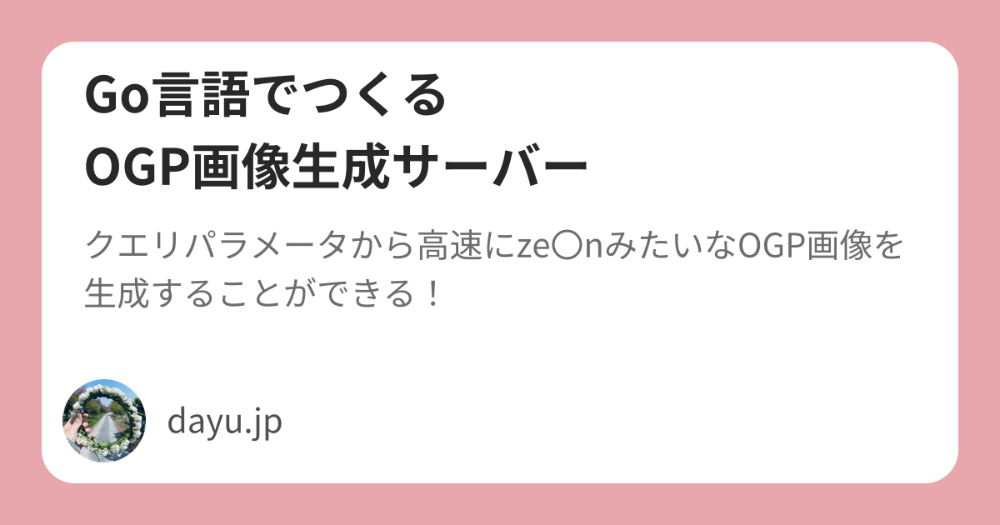

# Go言語製OGP画像生成HTTPサーバー



## 使い方

`/og.png`にクエリパラメータで`title`と`description`をURLsafeBASE64で送る

```URL
 /og.png?title=R2_oqIDoqp7jgafjgaTjgY_jgosKT0dQ55S75YOP55Sf5oiQ44K144O844OQ44O8&description=44Kv44Ko44Oq44OR44Op44Oh44O844K_44GL44KJ6auY6YCf44GremXjgIdu44G_44Gf44GE44GqT0dQ55S75YOP44KS55Sf5oiQ44GZ44KL44GT44Go44GM44Gn44GN44KL77yB
```

## カスタム

src/og/og.goの定数を変えることでユーザー名とアイコンと外枠の色が変更できます

```
const ICON_PATH = "./assets/icon.png"
const USER_NAME = "dayu.jp"
const FRAME_COLOR = "#E8A7AC"
```

## 使用ライブラリ

- github.com/fogleman/gg
- golang.org/x/image/draw
- golang.org/x/image/font
- golang.org/x/image/font/opentype
